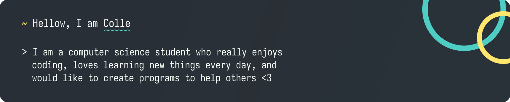

<h1>Hey! Nice to meet you ^^</h1>
<a href="https://colle.dev">
    

        

</a>

 

    <h3>Technologies I Love ♥️</h3>
    

        
    

 
 

 

    <h3>Technologies I Like 😁</h3>
    

    
    

 
 

 

    <h3>Technologies I'd Like to learn 🎓</h3>
    

        
    

 
 

 
Still there?

checkout my [website](https://colle.dev) ^^